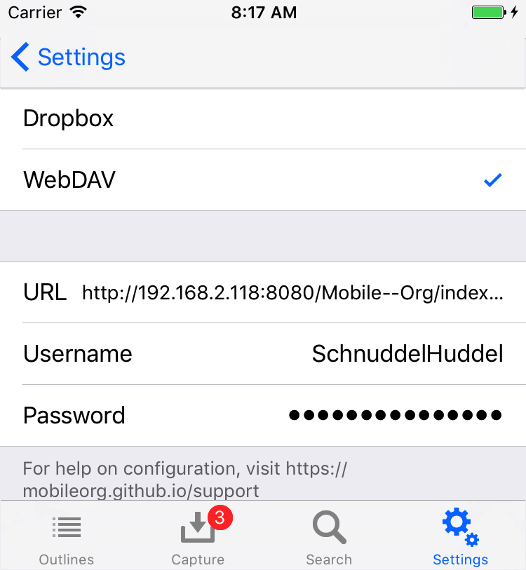
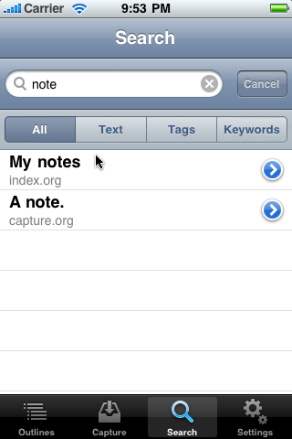
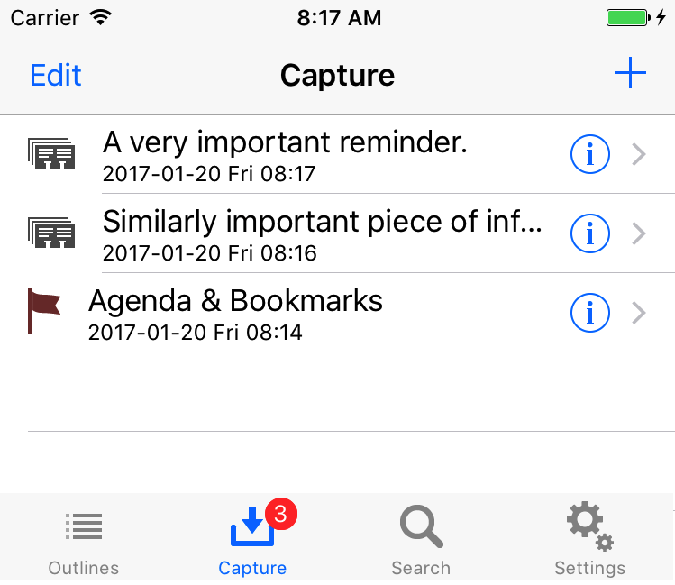

<a href="https://itunes.apple.com/us/app/mobileorg/id634225528?mt=8" style="display:inline-block;overflow:hidden;background:url(//linkmaker.itunes.apple.com/assets/shared/badges/en-us/appstore-lrg.svg) no-repeat;width:135px;height:40px;background-size:contain;"></a>

# Features

## MobileOrg feature overview

- Support for Dropbox or WebDAV as a transfer mechanism
- Org files are stored offline and available anywhere
- Complete editing support, including editable headings, body text,
  todo state, tags and priority.
- Note-taking facility built in, including offline support
- Full-text search, or search by keyword (TODO, DONE, WAITING) or by
  tag (errand, office)
- Mark nodes as done, or flag them with an optional note for reference
  later
- Document view of your outlines, for reading document-style Org files
  with long body text
- Powerful support for linking between Org files
- Org mode integration with [org-mobile.el](http://orgmode.org/manual/MobileOrg.html)

Org mode has built-in support for MobileOrg (or any other mobile
client that may come along in the future and use the same asymmetric
synchronization approach).

**org-mobile.el** ships with Org and provides the following features:

A simple `org-mobile-push` will stage your complete set of Org-files for
MobileOrg to pick them up. The result includes:

- An Org file representing all of your custom agenda views
  - Automatic checksum file construction to speed up sync
  - Automatic index.org file generation with links to all of your Org
    files
- A powerful `org-mobile-pull` command, which will integrate changes
  you’ve made on the go into a local Org file

# Documentation

### Getting Started

MobileOrg uses a WebDAV server or Dropbox to interact with your
Org files. It downloads Org files from the server and uploads
captured notes to a `mobileorg.org` file on the same server. The
documentation below covers how to get started using Dropbox or set up
a WebDAV account (using free services or your own server), how to
download and finally browse Org files stored on your device.

Be sure to install MobileOrg prior to following these guides. You can
find MobileOrg in the App Store on your device by searching for
MobileOrg.

[Using Dropbox](#using-dropbox)

[Setup your WebDAV account](#setup-your-webdav-account)

[Syncing with MobileOrg](#syncing-with-mobileorg)

[Browsing your Org files](#browsing-your-org-files)

[Encryption](#encryption)

Once you are comfortable browsing your Org files, take a look at the
following documents to help you get even more from MobileOrg.

[Mastering search](#mastering-search)

[Capturing notes](#capturing-notes)

[Integrating with Org mode](#integrating-with-orgmode)

[Frequently Asked Questions](#frequently-asked-questions)

## Using Dropbox

If you're not familiar with it already, Dropbox provides 2GB of free storage
that can be synchronized between multiple devices. MobileOrg can use Dropbox as
a transfer backend as an alternative to WebDAV to make setup easier. 

To get started with MobileOrg + Dropbox:

- You must first setup an account on http://www.dropbox.com
- Open MobileOrg, go to Settings, choose the Dropbox button at the
  top. Enter your email address and password, then click ‘Log in to
  Dropbox’.
- If login was successful, please proceed. Otherwise, correct your
  credentials/make sure you have network access, and retry.
- Upon successful login, a new folder, `~/Dropbox/Apps/MobileOrg` will
  automatically be created.
- You should edit your Org mode configuration to contain something like this:

```
;; Set to the location of your Org files on your local system
(setq org-directory "~/org")
;; Set to the name of the file where new notes will be stored
(setq org-mobile-inbox-for-pull "~/org/flagged.org")
;; Set to <your Dropbox root directory>/MobileOrg.
(setq org-mobile-directory "~/Dropbox/Apps/MobileOrg")
```

- After restarting emacs/reparsing your configuration, run
  org-mobile-push. This will copy your Org files to
  ~/Dropbox/Apps/MobileOrg, which is where MobileOrg will read from.
  - If you use [spacemacs](http://spacemacs.org/) just type: `SPC q r`
- Go back to MobileOrg and click on the Outlines tab at the bottom,
  then click the Sync button in the upper right.

After capturing notes or making changes on the device to your Org
files, be sure to sync in MobileOrg. Then run `org-mobile-pull` from
Emacs to integrate your changes. After integrating, you can run
`org-mobile-push` to make sure MobileOrg has access to the latest
version of your files.

You can certainly automate this using existing elisp functions in emacs if you
choose to. See [this mailing list discussion](https://www.mail-archive.com/emacs-orgmode@gnu.org/msg110544.html)
for some pointers

_NOTE:_ If you already had a MobileOrg directory in your
~/Dropbox/Apps, a new folder will be created like `MobileOrg (1)`. You
should rename the newly created `MobileOrg (1)` folder to something that
makes more sense, perhaps MobileOrg-staging before proceeding. Be sure
your `org-mobile-directory` Emacs variable reflects this change.

_ANOTHER NOTE:_ If you are a Windows user, you will need to have
md5sum.exe or sha1sum.exe in your system path before org-mobile-push
will succeed. You can find either of them here:
http://gnuwin32.sourceforge.net/packages/coreutils.htm
See the [code here](http://orgmode.org/cgit.cgi/org-mode.git/tree/lisp/org-mobile.el#n194) for more info

## Setup your WebDAV account

MobileOrg can also use the WebDAV protocol to stay up-to-date and synchronize
notes. WebDAV is a set of extensions to HTTP that allow client
applications such as MobileOrg to not only read the contents of files
on a web server but to write changes to them as well. This allows
MobileOrg to have a two-way communications channel with your web
server.

### What goes on the WebDAV server?

Your Org files, in whatever directory you would like. The examples
below use an org subfolder with a primary Org file named
`index.org`. Other Org files may reside alongside `index.org` if you
would like. [Syncing with MobileOrg](#syncing-with-mobileorg) describes how to link
multiple Org files together.

For example, on my Mac, I have my WebDAV share mounted at
`/Volumes/private`.

```
$ ls /Volumes/private/org
index.org meetings.org reference.org
```

These files are then accessible via WebDAV at:
`http://www.example.com/private/org/index.org`

### Choosing a WebDAV server

You have several options to choose from:

- Use a local webdav server
- If you run ownCloud, [it supports webdav](https://doc.owncloud.org/server/9.0/user_manual/files/access_webdav.html)
- Use a repository service, like https://deveo.com/
- Use your own Apache webserver with mod_dav
- Use your own nginx webserver

Setup of any of these is outside the scope of this documentation although we
have a little info here. Your decision will not affect the operation of
MobileOrg, but it will determine what settings you will need to input on the
Settings page. The Settings page is available at any time by clicking the
Settings icon in the lower application toolbar.

There are 3 user-configurable fields:

- **Address**: This is the complete URL to an index.org file on a
  WebDAV server. For instance,
  http://www.example.com/private/org/index.org.
- **Username**: Your WebDAV share’s username. It is highly recommended
  to password protect your Org files!
- **Password**: Your WebDAV share’s password.



If you would like to verify that your WebDAV server is setup
correctly, visit the server address in your web browser. If the Org
file is displayed or downloaded, you will know that it is working. If
not, please check your settings against the examples below. Visit our
Support page if you have any trouble.

#### Using a Local WebDAV Server

The solution you like to choose depends on the operating system you're
on.

- MacOS: WebDAV was supported natively in the past by
  MacOS. Unfortunately it is not more. If you like to setup a WebDAV
  server on your Mac you might find
  [WebDAVNav Server](https://itunes.apple.com/gb/app/webdavnav-server/id747482894?mt=12)
  useful.

- Unix:

- Linux:

- Windows:

#### Using your own Apache server with mod_dav

Hosting your own WebDAV server is easy if you have access to an Apache
webserver. In an appropriate configuration block, add:

```
DAVLockDB /usr/local/apache/var/DAVLock
<Location /org>
    DAV On  
    AuthType Basic
    AuthName "My Org Files"
    AuthUserFile /path/to/htpasswd-file
    <Limit GET PUT POST DELETE PROPFIND PROPPATCH MKCOL COPY MOVE LOCK UNLOCK>
        Require valid-user
    </Limit>
</Location>

```

Be sure to setup some type of authentication, either using
AuthUserFile or some other more advanced means, depending on your
needs.

Once you have configured your server, point MobileOrg to your
index.org file in the Address portion of the Server Config settings.

#### Using your own nginx server

[Tim Dysinger](http://tim.dysinger.net) has contributed instructions to setup nginx for MobileOrg
use.

```
#!/bin/sh

# on ubuntu: need some utils & dev libs
sudo apt-get install apache2-utils openssl libssl-dev libpcre3-dev
 
# compile nginx
cd /tmp
curl http://nginx.org/download/nginx-0.7.64.tar.gz | tar xz
cd nginx*
./configure --with-http_ssl_module --with-http_dav_module \
  --prefix=$HOME/nginx
make && make install
 
# generate an htpasswd file
htpasswd -c ~/.htpasswd $(whoami)
  
# ssl
openssl genrsa 1024 > ~/nginx/conf/server.key
openssl req -new -x509 -nodes -sha1 -days 365 \
    -key ~/nginx/conf/server.key > ~/nginx/conf/server.crt
  
# configure
cat > ~/nginx/conf/nginx.conf <<EOF
events {
    worker_connections 1024;
}
http {
   include mime.types;
   default_type application/octet-stream;
   ssl_certificate server.crt;
   ssl_certificate_key server.key;
   auth_basic "Restricted";
   auth_basic_user_file $HOME/.htpasswd;
   dav_methods put delete mkcol copy move;
   dav_access user:rw;
   create_full_put_path on;
   server {
       listen 1080;
       listen 1443 ssl;
       location ~ ^/org(/.*)?$ {
           alias $HOME/org/mobile\$1;
       }
   }
}
EOF
 
# now you can start nginx
~/nginx/sbin/nginx
 
# and then sync w/ org-mobile-push/pull & mobileorg sync
# URL: http://<my-nginx-ip-addr>:1080/org/index.org
# or use
# URL: https://<my-nginx-ip-addr>:1443/org/index.org
# and your username and password you used above for htpasswd
```

## Syncing with MobileOrg

Once your server is properly configured, you can click on the Outlines
toolbar icon, then click the Sync icon to start fetching your files.

### What files are transferred?

Your `index.org` file is fetched, then any files it links to are
fetched, and so on. For example, in the following case, 4 .org files
will be transferred: `index.org`, `first.org`, `second.org` and
`third.org`. You may notice `third.org` is linked to from two different
places, but it is only downloaded once.

#### Contents of index.org:

```
* [[file:first.org][An Org file I like]]
* [[file:second.org][Another Org file I like]]
  This is a [[file:third.org][link]] in the body text.
```
  
#### Contents of first.org:

```
* Some text
* [[file:third.org][Link to third.org]]
```

For the sake of our example, the files `second.org` and `third.org` do not
contain any links, so their contents are irrelevant.

The sync process continues until all Org files (and the Org files they
link to) have been downloaded.

### Are my files transferred every time?

MobileOrg uses a fairly simple caching mechanism to prevent from
unnecessarily downloading the same Org files repeatedly. If a file
named `checksums.dat` exists in parallel to your `index.org` file on the
server, only files whose checksums have changed will be re-downloaded. 
This file is [updated automatically](http://orgmode.org/cgit.cgi/org-mode.git/tree/lisp/org-mobile.el#n494) when running `org-mobile-push` from emacs.

If you do not use `org-mobile-push` you will need to keep the `checksums.dat` file
up-to-date any time changes are made to your Org files.

#### Constructing checksums.dat:

```
$ md5sum * >checksums.dat
$ cat checksums.dat
2b00042f7481c7b056c4b410d28f33cf  first.org
41930d894e1a4c2353b85d0b8d96f381  index.org
e5b12e4697d09fa9757d3dc6fcaa5c5b  second.org
05eaf1239d84508477cda9d0fa86b1a1  third.org
```

If your Org file structure consists of subdirectories as well, you can
use the following script to generate the checksum file recursively:

```
find . -name "*.org" -type f -print | sed 's/^\.\///' | xargs md5sum >checksums.dat
```

MobileOrg recognizes the output of `md5sum`, `md5` (on OSX), `shasum` and `sha1sum`.

## Browsing your Org files

MobileOrg tries to make it easy to manage Org files both large and
small.

### Walking the hierarchy

Clicking on the text of a node in the Outline view will drill you down
one level deeper into the tree and display that node’s children. To go
back to the node you were previously viewing, click the back-arrow
button in the upper left corner.

If the node you click on has no children, its details page will be
displayed instead. See the next section for more information.

### Viewing node details

To view the details for any node, click on the blue disclosure icon on
the right of the cell. The details page shows the node title and full
body text.

### Action Menu

The Action Menu is a context-sensitive menu that allows you to perform
actions on nodes, such as marking them as done or viewing them as HTML
documents. To bring up the Action Menu, touch and hold your finger on
any node’s title text in the Outline view. The Action Menu will slide
up and present you with several action buttons.

### Document view

While the Outline tree is very useful to quickly browse the outline
and find a particular node, it is not the best representation as far
as readability of notes is concerned, because the headlines and the
body text are structurally separated. For reading, MobileOrg has a
Document View which shows an HTML representation of an entire file or
subtree, rooted at whatever level you choose to open it at. Document
View can be accessed through the Action Menu, or from the details page
of a node.

 

## Encryption

MobileOrg supports basic symmetric encryption so that files on your WebDAV server
or Dropbox are not stored in plain text.

Be sure you are using at least MobileOrg 1.5+ and Org mode 7.02+.

To configure Org mode to use encryption, use:

```
;; Enable encryption
(setq org-mobile-use-encryption t)
;; Set a password
(setq org-mobile-encryption-password "mypassword")
```

Then run `org-mobile-push` from Emacs after reloading your configuration
file. You should notice that the files in your staging area are
encrypted.

Next, open MobileOrg and enter your encryption password in the
Settings tab. Perform a sync, and you are done.

## Mastering Search

MobileOrg provides a powerful full-text search, as well as
property-based searches for keywords and tags.

### Defining your search

The search bar allows you to enter in a string of text to search
for. MobileOrg searches for this entire phrase. OR combinations are
currently not supported. MobileOrg’s search capability is
case-INsensitive.

Beneath the search bar are several scope buttons.



Choosing All performs a full-text search of the following:

- Node title and body text
- Tags
- Keywords (such as TODO or DONE)

Choosing an option other than *All* narrows the search to one of the
above categories.

## Capturing Notes

MobileOrg allows you to capture notes whether you are online or
off. Notes are uploaded to the server during the next sync.

### How do I capture a new note?

To capture a new note, click on the *Capture* icon in the application
toolbar, then click the + icon in the navigation toolbar. Enter in
your note, then click Done.



The number of notes waiting to be synced appears as an indicator count
by the *Capture* toolbar icon. After you sync, this count disappears to
let you know you have no pending notes.

### Where do notes go after a sync?

Notes are appended to the end of the `mobileorg.org` file on your WebDAV
server. If this file does not exist when you try to sync, MobileOrg
will attempt to create it.

It is generally **NOT** recommended to reference `mobileorg.org` as a
link from your `index.org` file.

When you get back to your desktop computer, you can refile your
captured notes into your primary Org mode files by following these
steps:

1) In Emacs, initiate a pull by typing `M-x org-mobile-pull RET`

2) The notes you captured in the MobileOrg app will be appended to a
file called `from-mobile.org in your default org directory (variable
*org-directory*). You may specify a different file and location by
explicitly setting the variable *org-mobile-inbox-for-pull*.

3) Refile your notes by switching to the `from-mobile.org` buffer, and
using `C-c C-w` Note that the changes you made to existing outline nodes
will simply be automatically applied by the `org-mobile-pull`
function. Those changes will only appear in `from-mobile.org` if they
could not be applied (e.g., if the target Org-file changed so much
that the context can no longer be located).

If you are not using the
[Org mode integration]((#integration-with-org-mode)), you can disregard
these steps and manage the `mobileorg.org` file yourself using whatever
means you choose.

## Integrating with Org mode

Emacs Org mode integrates with MobileOrg by staging files for download
to the mobile device, and by automatically processing captured notes
and flagged items. For more information see Appendix B of the Org mode
manual.

MobileOrg 1.0 requires Org mode 6.32 or greater.

# Frequently Asked Questions

#### Why doesn't MobileOrg support direct access to org-files

Answer: MobileOrg is intended to be a useful interface to Org files on iOS, not to allow you to edit Org files with the same power as emacs.

#### Why doesn't MobileOrg support synchronisation over github

Answer: The current asynchronous method of push/pull with org-mobile.el could lead to a number of conflicts with git. However git synchronisation is a feature planned to be worked on in the future.

#### Whenever I switch to MobileOrg a new note is created

Answer: This occurs if 'Autocapture' is switched on, some find this desirable for rapidly capturing ideas.

# Development

Development takes place on
[GitHub](https://github.com/MobileOrg/mobileorg)

## Contributing

If you like to contribute visit our GitHub project. There you can find
out
[how to contribute](https://github.com/MobileOrg/mobileorg#contributing).

# Credits

MobileOrg is thanks to the following:

#### Original Authors

- [Richard Moreland](https://github.com/richard)
  - MobileOrg

- [Carsten Dominik](http://carstendominik.net)
  - Design and Emacs integration

#### Current Developers

- [Sean Escriva](https://github.com/webframp)
  - Development and Organization

- [Mario Martelli](https://github.com/mgmart)
  - Development and Organisation

- [Jamie Conlon](https://github.com/jamie-conlon)
  - Development
  
- [Boris](https://github.com/d12frosted)
  - Graphics and Ideas
  
#### Past Developers

- Alex Rodich
  - Development and Organization

- [Greg Newman](http://gregnewman.org)
  - Updated app icon

- [Christophe Bataillon](http://bataillon.ultra-book.com/accueil)
  - Original app icon

- Joseph Wain of glyphish.com
  - Creative Commons Attribution icons

- Chris Trompette
  - Dropbox API work and fixes

- [Sean Allred](https://github.com/vermiculus)
  - Auto capture mode and fixes

- [Russell McClellan](https://github.com/russellmcc)

- [Thomas Klausner](https://github.com/0-wiz-0)

# Release Notes

## Known Issues

- WebDav/https connections are not established if a self-signed certificate is used.
  The result is a simple `failure` while downloading `checksums.dat`.
- The popup which is used for flagging a note appears misplaced on
  screen.

## MobileOrg Release Notes

### MobileOrg 1.7.1

#### Upgrades
  - FEATURE: Support for iOS 9 & 10 
    - Older versions are no longer supported. Sorry, its time we deal with the upgrade path.
    - *you can always use v1.6.1 [still available from the AppStore](https://itunes.apple.com/us/app/mobileorg/id634225528?mt=8)*
  - BACKEND: Dropbox API v2 

#### New
  - UI: Old Org mode icon is back (Throwback unicorn)
  - UI: Screens are adapted to new iOS look and feel (sorry if you loved that retro iOS look)
  - UI: New Launchscreen
  - UI: New icons - thanks [Boris](https://github.com/MobileOrg/mobileorg/pull/132)!

#### Fixes
  - ENHANCEMENT: Filenames with accented-, whitespace- and
    punctuation-characters are recognised.
    [#59](https://github.com/MobileOrg/mobileorg/issues/59) and
    [#61](https://github.com/MobileOrg/mobileorg/issues/61)
  - ENHANCEMENT: Mono-spaced font in capture
    [#74](https://github.com/MobileOrg/mobileorg/issues/74)
  - ENHANCEMENT: Bigger font in editor
	[#34](https://github.com/MobileOrg/mobileorg/issues/34)
  - BUG: Fixed bug where the capture-badge was not updated if a
    capture was deleted
  - BUG: Wrong size of editor window
    [#57](https://github.com/MobileOrg/mobileorg/issues/57)
  - BUG: Wrong colouring of keywords
    [#80](https://github.com/MobileOrg/mobileorg/issues/80)
  - BUG: Heading level skips
    [#62](https://github.com/MobileOrg/mobileorg/issues/62)
  - BUG: Capture icon badge shows wrong count
    [#18](https://github.com/MobileOrg/mobileorg/issues/18)
  
### MobileOrg 1.6.1 

#### New
  - UI: New Org mode logo
  - UI: New icons
  - FEATURE: Autocapture
  
### MobileOrg 1.5.1

*Note: All versions older than 1.6 are no longer available in the AppStore*

#### Fixes
  - BUG: Fix crash bug introduced for users of 1.5 who weren’t using
    encryption.
  
### MobileOrg 1.5

#### New
  - FEATURE: Encryption support (Encryption help)

### MobileOrg 1.4

#### Upgrades
  - FEATURE: Add support for iOS 4
  - FEATURE: Add support for iPad
  
#### Fixes
  - BUG: Fix bug where Dropbox password wouldn’t be accepted unless
  you hit enter after typing it
  - BUG: Fix “Bad file encoding” bug in captured notes list when using
    Dropbox.
  - UI: Make keyboard use email style when entering Dropbox email
    address.

### MobileOrg 1.3

#### New
  - FEATURE: Add support for Dropbox in addition to WebDAV. Just link
    with your Dropbox account in MobileOrg settings, then set
    ~/Dropbox/MobileOrg as your staging directory in Org mode. Then
    org-mobile-push and sync in MobileOrg, and that’s all there is to
    it.

### MobileOrg 1.2

#### Fixes
  - BUG: Captured notes list was not emptying even after a full sync
    cycle.
  
### MobileOrg 1.1

#### New
  - FEATURE: Add back the ‘…’ indicator for items with children
  - FEATURE: Add application badge to show unsynced item count on
    iPhone home screen (configurable via Settings page)
  - FEATURE: Add support for strikethrough text in document view
  - FEATURE: Support org files named “.org”
  - UI: Sort tag list case insensitively
  - UI: Make todo state and priority pages close on selection (or
    clear button)

#### Fixes 
  - BUG: Escape *’s at the beginning of notes (prevents breakage)
  - BUG: Settings page no longer clears local cache when URL field is
    selected but not changed
  - BUG: Fix action menu not working on Agenda items
  - BUG: Support Windows newlines everywhere
  - BUG: Use less memory when parsing, handle larger files
  - BUG: Support org files with multiple dots in filenames
  - BUG: Action menu/sync status pages were acting strange when phone
    was placed in an unknown orientation state (laying flat, mostly)
 
# License

#### GNU General Public License

_Version 2, June 1991_  
_Copyright © 1989, 1991 Free Software Foundation, Inc.,_  
_51 Franklin Street, Fifth Floor, Boston, MA 02110-1301 USA_

Everyone is permitted to copy and distribute verbatim copies
of this license document, but changing it is not allowed.

### Preamble

The licenses for most software are designed to take away your
freedom to share and change it.  By contrast, the GNU General Public
License is intended to guarantee your freedom to share and change free
software--to make sure the software is free for all its users.  This
General Public License applies to most of the Free Software
Foundation's software and to any other program whose authors commit to
using it.  (Some other Free Software Foundation software is covered by
the GNU Lesser General Public License instead.)  You can apply it to
your programs, too.

When we speak of free software, we are referring to freedom, not
price.  Our General Public Licenses are designed to make sure that you
have the freedom to distribute copies of free software (and charge for
this service if you wish), that you receive source code or can get it
if you want it, that you can change the software or use pieces of it
in new free programs; and that you know you can do these things.

To protect your rights, we need to make restrictions that forbid
anyone to deny you these rights or to ask you to surrender the rights.
These restrictions translate to certain responsibilities for you if you
distribute copies of the software, or if you modify it.

For example, if you distribute copies of such a program, whether
gratis or for a fee, you must give the recipients all the rights that
you have.  You must make sure that they, too, receive or can get the
source code.  And you must show them these terms so they know their
rights.

We protect your rights with two steps: **(1)** copyright the software, and
**(2)** offer you this license which gives you legal permission to copy,
distribute and/or modify the software.

Also, for each author's protection and ours, we want to make certain
that everyone understands that there is no warranty for this free
software.  If the software is modified by someone else and passed on, we
want its recipients to know that what they have is not the original, so
that any problems introduced by others will not reflect on the original
authors' reputations.

Finally, any free program is threatened constantly by software
patents.  We wish to avoid the danger that redistributors of a free
program will individually obtain patent licenses, in effect making the
program proprietary.  To prevent this, we have made it clear that any
patent must be licensed for everyone's free use or not licensed at all.

The precise terms and conditions for copying, distribution and
modification follow.

### TERMS AND CONDITIONS FOR COPYING, DISTRIBUTION AND MODIFICATION

**0.** This License applies to any program or other work which contains
a notice placed by the copyright holder saying it may be distributed
under the terms of this General Public License.  The “Program”, below,
refers to any such program or work, and a “work based on the Program”
means either the Program or any derivative work under copyright law:
that is to say, a work containing the Program or a portion of it,
either verbatim or with modifications and/or translated into another
language.  (Hereinafter, translation is included without limitation in
the term “modification”.)  Each licensee is addressed as “you”.

Activities other than copying, distribution and modification are not
covered by this License; they are outside its scope.  The act of
running the Program is not restricted, and the output from the Program
is covered only if its contents constitute a work based on the
Program (independent of having been made by running the Program).
Whether that is true depends on what the Program does.

**1.** You may copy and distribute verbatim copies of the Program's
source code as you receive it, in any medium, provided that you
conspicuously and appropriately publish on each copy an appropriate
copyright notice and disclaimer of warranty; keep intact all the
notices that refer to this License and to the absence of any warranty;
and give any other recipients of the Program a copy of this License
along with the Program.

You may charge a fee for the physical act of transferring a copy, and
you may at your option offer warranty protection in exchange for a fee.

**2.** You may modify your copy or copies of the Program or any portion
of it, thus forming a work based on the Program, and copy and
distribute such modifications or work under the terms of Section 1
above, provided that you also meet all of these conditions:

* **a)** You must cause the modified files to carry prominent notices
stating that you changed the files and the date of any change.
* **b)** You must cause any work that you distribute or publish, that in
whole or in part contains or is derived from the Program or any
part thereof, to be licensed as a whole at no charge to all third
parties under the terms of this License.
* **c)** If the modified program normally reads commands interactively
when run, you must cause it, when started running for such
interactive use in the most ordinary way, to print or display an
announcement including an appropriate copyright notice and a
notice that there is no warranty (or else, saying that you provide
a warranty) and that users may redistribute the program under
these conditions, and telling the user how to view a copy of this
License.  (Exception: if the Program itself is interactive but
does not normally print such an announcement, your work based on
the Program is not required to print an announcement.)

These requirements apply to the modified work as a whole.  If
identifiable sections of that work are not derived from the Program,
and can be reasonably considered independent and separate works in
themselves, then this License, and its terms, do not apply to those
sections when you distribute them as separate works.  But when you
distribute the same sections as part of a whole which is a work based
on the Program, the distribution of the whole must be on the terms of
this License, whose permissions for other licensees extend to the
entire whole, and thus to each and every part regardless of who wrote it.

Thus, it is not the intent of this section to claim rights or contest
your rights to work written entirely by you; rather, the intent is to
exercise the right to control the distribution of derivative or
collective works based on the Program.

In addition, mere aggregation of another work not based on the Program
with the Program (or with a work based on the Program) on a volume of
a storage or distribution medium does not bring the other work under
the scope of this License.

**3.** You may copy and distribute the Program (or a work based on it,
under Section 2) in object code or executable form under the terms of
Sections 1 and 2 above provided that you also do one of the following:

* **a)** Accompany it with the complete corresponding machine-readable
source code, which must be distributed under the terms of Sections
1 and 2 above on a medium customarily used for software interchange; or,
* **b)** Accompany it with a written offer, valid for at least three
years, to give any third party, for a charge no more than your
cost of physically performing source distribution, a complete
machine-readable copy of the corresponding source code, to be
distributed under the terms of Sections 1 and 2 above on a medium
customarily used for software interchange; or,
* **c)** Accompany it with the information you received as to the offer
to distribute corresponding source code.  (This alternative is
allowed only for noncommercial distribution and only if you
received the program in object code or executable form with such
an offer, in accord with Subsection b above.)

The source code for a work means the preferred form of the work for
making modifications to it.  For an executable work, complete source
code means all the source code for all modules it contains, plus any
associated interface definition files, plus the scripts used to
control compilation and installation of the executable.  However, as a
special exception, the source code distributed need not include
anything that is normally distributed (in either source or binary
form) with the major components (compiler, kernel, and so on) of the
operating system on which the executable runs, unless that component
itself accompanies the executable.

If distribution of executable or object code is made by offering
access to copy from a designated place, then offering equivalent
access to copy the source code from the same place counts as
distribution of the source code, even though third parties are not
compelled to copy the source along with the object code.

**4.** You may not copy, modify, sublicense, or distribute the Program
except as expressly provided under this License.  Any attempt
otherwise to copy, modify, sublicense or distribute the Program is
void, and will automatically terminate your rights under this License.
However, parties who have received copies, or rights, from you under
this License will not have their licenses terminated so long as such
parties remain in full compliance.

**5.** You are not required to accept this License, since you have not
signed it.  However, nothing else grants you permission to modify or
distribute the Program or its derivative works.  These actions are
prohibited by law if you do not accept this License.  Therefore, by
modifying or distributing the Program (or any work based on the
Program), you indicate your acceptance of this License to do so, and
all its terms and conditions for copying, distributing or modifying
the Program or works based on it.

**6.** Each time you redistribute the Program (or any work based on the
Program), the recipient automatically receives a license from the
original licensor to copy, distribute or modify the Program subject to
these terms and conditions.  You may not impose any further
restrictions on the recipients' exercise of the rights granted herein.
You are not responsible for enforcing compliance by third parties to
this License.

**7.** If, as a consequence of a court judgment or allegation of patent
infringement or for any other reason (not limited to patent issues),
conditions are imposed on you (whether by court order, agreement or
otherwise) that contradict the conditions of this License, they do not
excuse you from the conditions of this License.  If you cannot
distribute so as to satisfy simultaneously your obligations under this
License and any other pertinent obligations, then as a consequence you
may not distribute the Program at all.  For example, if a patent
license would not permit royalty-free redistribution of the Program by
all those who receive copies directly or indirectly through you, then
the only way you could satisfy both it and this License would be to
refrain entirely from distribution of the Program.

If any portion of this section is held invalid or unenforceable under
any particular circumstance, the balance of the section is intended to
apply and the section as a whole is intended to apply in other
circumstances.

It is not the purpose of this section to induce you to infringe any
patents or other property right claims or to contest validity of any
such claims; this section has the sole purpose of protecting the
integrity of the free software distribution system, which is
implemented by public license practices.  Many people have made
generous contributions to the wide range of software distributed
through that system in reliance on consistent application of that
system; it is up to the author/donor to decide if he or she is willing
to distribute software through any other system and a licensee cannot
impose that choice.

This section is intended to make thoroughly clear what is believed to
be a consequence of the rest of this License.

**8.** If the distribution and/or use of the Program is restricted in
certain countries either by patents or by copyrighted interfaces, the
original copyright holder who places the Program under this License
may add an explicit geographical distribution limitation excluding
those countries, so that distribution is permitted only in or among
countries not thus excluded.  In such case, this License incorporates
the limitation as if written in the body of this License.

**9.** The Free Software Foundation may publish revised and/or new versions
of the General Public License from time to time.  Such new versions will
be similar in spirit to the present version, but may differ in detail to
address new problems or concerns.

Each version is given a distinguishing version number.  If the Program
specifies a version number of this License which applies to it and “any
later version”, you have the option of following the terms and conditions
either of that version or of any later version published by the Free
Software Foundation.  If the Program does not specify a version number of
this License, you may choose any version ever published by the Free Software
Foundation.

**10.** If you wish to incorporate parts of the Program into other free
programs whose distribution conditions are different, write to the author
to ask for permission.  For software which is copyrighted by the Free
Software Foundation, write to the Free Software Foundation; we sometimes
make exceptions for this.  Our decision will be guided by the two goals
of preserving the free status of all derivatives of our free software and
of promoting the sharing and reuse of software generally.

### NO WARRANTY

**11.** BECAUSE THE PROGRAM IS LICENSED FREE OF CHARGE, THERE IS NO WARRANTY
FOR THE PROGRAM, TO THE EXTENT PERMITTED BY APPLICABLE LAW.  EXCEPT WHEN
OTHERWISE STATED IN WRITING THE COPYRIGHT HOLDERS AND/OR OTHER PARTIES
PROVIDE THE PROGRAM “AS IS” WITHOUT WARRANTY OF ANY KIND, EITHER EXPRESSED
OR IMPLIED, INCLUDING, BUT NOT LIMITED TO, THE IMPLIED WARRANTIES OF
MERCHANTABILITY AND FITNESS FOR A PARTICULAR PURPOSE.  THE ENTIRE RISK AS
TO THE QUALITY AND PERFORMANCE OF THE PROGRAM IS WITH YOU.  SHOULD THE
PROGRAM PROVE DEFECTIVE, YOU ASSUME THE COST OF ALL NECESSARY SERVICING,
REPAIR OR CORRECTION.

**12.** IN NO EVENT UNLESS REQUIRED BY APPLICABLE LAW OR AGREED TO IN WRITING
WILL ANY COPYRIGHT HOLDER, OR ANY OTHER PARTY WHO MAY MODIFY AND/OR
REDISTRIBUTE THE PROGRAM AS PERMITTED ABOVE, BE LIABLE TO YOU FOR DAMAGES,
INCLUDING ANY GENERAL, SPECIAL, INCIDENTAL OR CONSEQUENTIAL DAMAGES ARISING
OUT OF THE USE OR INABILITY TO USE THE PROGRAM (INCLUDING BUT NOT LIMITED
TO LOSS OF DATA OR DATA BEING RENDERED INACCURATE OR LOSSES SUSTAINED BY
YOU OR THIRD PARTIES OR A FAILURE OF THE PROGRAM TO OPERATE WITH ANY OTHER
PROGRAMS), EVEN IF SUCH HOLDER OR OTHER PARTY HAS BEEN ADVISED OF THE
POSSIBILITY OF SUCH DAMAGES.

END OF TERMS AND CONDITIONS

### How to Apply These Terms to Your New Programs

If you develop a new program, and you want it to be of the greatest
possible use to the public, the best way to achieve this is to make it
free software which everyone can redistribute and change under these terms.

To do so, attach the following notices to the program.  It is safest
to attach them to the start of each source file to most effectively
convey the exclusion of warranty; and each file should have at least
the “copyright” line and a pointer to where the full notice is found.

    <one line to give the program's name and a brief idea of what it does.>
    Copyright (C) <year>  <name of author>
    
    This program is free software; you can redistribute it and/or modify
    it under the terms of the GNU General Public License as published by
    the Free Software Foundation; either version 2 of the License, or
    (at your option) any later version.
    
    This program is distributed in the hope that it will be useful,
    but WITHOUT ANY WARRANTY; without even the implied warranty of
    MERCHANTABILITY or FITNESS FOR A PARTICULAR PURPOSE.  See the
    GNU General Public License for more details.
    
    You should have received a copy of the GNU General Public License along
    with this program; if not, write to the Free Software Foundation, Inc.,
    51 Franklin Street, Fifth Floor, Boston, MA 02110-1301 USA.

Also add information on how to contact you by electronic and paper mail.

If the program is interactive, make it output a short notice like this
when it starts in an interactive mode:

    Gnomovision version 69, Copyright (C) year name of author
    Gnomovision comes with ABSOLUTELY NO WARRANTY; for details type `show w'.
    This is free software, and you are welcome to redistribute it
    under certain conditions; type `show c' for details.

The hypothetical commands `show w` and `show c` should show the appropriate
parts of the General Public License.  Of course, the commands you use may
be called something other than `show w` and `show c`; they could even be
mouse-clicks or menu items--whatever suits your program.

You should also get your employer (if you work as a programmer) or your
school, if any, to sign a “copyright disclaimer” for the program, if
necessary.  Here is a sample; alter the names:

    Yoyodyne, Inc., hereby disclaims all copyright interest in the program
    `Gnomovision' (which makes passes at compilers) written by James Hacker.
    
    <signature of Ty Coon>, 1 April 1989
    Ty Coon, President of Vice

This General Public License does not permit incorporating your program into
proprietary programs.  If your program is a subroutine library, you may
consider it more useful to permit linking proprietary applications with the
library.  If this is what you want to do, use the GNU Lesser General
Public License instead of this License.
