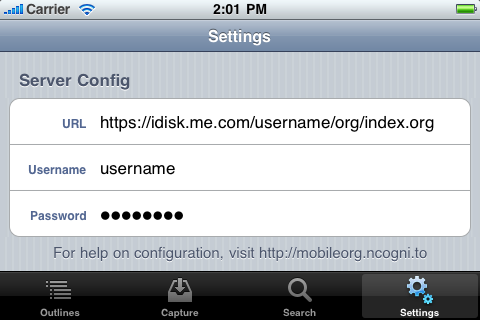

# Features

## MobileOrg feature overview

- Support for Dropbox or WebDAV as a transfer mechanism
- Org files are stored offline and available anywhere
- Complete editing support, including editable headings, body text,
  todo state, tags and priority.
- Note-taking facility built in, including offline support
- Full-text search, or search by keyword (TODO, DONE, WAITING) or by
  tag (errand, office)
- Mark nodes as done, or flag them with an optional note for reference
  later
- Document view of your outlines, for reading document-style Org files
  with long body text
- Powerful support for linking between Org files
- Org-mode integration

Org-mode has built-in support for MobileOrg (or any other mobile
client that may come along in the future and use the same asymmetric
synchronization approach).

A simple `org-mobile-push` will stage your complete set of Org-files for
MobileOrg to pick them up. The result includes:

- An Org file representing all of your custom agenda views
  - Automatic checksum file construction to speed up sync
  - Automatic index.org file generation with links to all of your Org
    files
- A powerful `org-mobile-pull` command, which will integrate changes
  you’ve made on the go into a local Org file

# Documentation

### Getting Started

MobileOrg uses a WebDAV server or Dropbox to interact with your
Org-files. It downloads Org files from the server, and uploads
captured notes to a mobileorg.org file on the same server. The
documentation below covers how to get started using Dropbox or set up
a WebDAV account (using free services or your own server), how to
download and finally browse Org-files stored on your device.

Be sure to install MobileOrg prior to following these guides. You can
find MobileOrg in the App Store on your device by searching for
MobileOrg.

[Using Dropbox](UsingDropbox.md)

[Setup your WebDAV account](UsingWebDAV.md)

[Syncing with MobileOrg](Syncing.md)

[Browsing your Org files](Browsing.md)

[Encryption](Encryption.md)

[Further Reading](FurtherReading.md)

Once you are comfortable browsing your Org files, take a look at the
following documents to help you get even more from MobileOrg.

[Mastering search](MasteringSearch.md)

[Capturing notes](CapturingNotes.md)

[Integrating with Org-mode](IntegratingWithOrgMode.md)

### Screencasts

[Overview of MobileOrg](Overview.md)

### Frequently Asked Questions

FAQ’s can be found on the
[MobileOrg GitHub](https://github.com/MobileOrg/mobileorg) page.

Development
- Release Notes
- How to contribute
- Credits
  - Current and past developers
  - Libraries used

## Using Dropbox

Dropbox provides 2GB of free storage that can be synchronized between
multiple devices. MobileOrg can use Dropbox as a transfer backend as
an alternative to WebDAV to make setup easier.

A [screencast]() is available that illustrates how to setup MobileOrg from
start to finish.

To get started with MobileOrg + Dropbox:

- You must first setup an account on http://www.dropbox.com
- Open MobileOrg, go to Settings, choose the Dropbox button at the
  top. Enter your email address and password, then click ‘Log in to
  Dropbox’.
- If login was successful, please proceed. Otherwise, correct your
  credentials/make sure you have network access, and retry.
- Upon successful login, a new folder, ~/Dropbox/Apps/MobileOrg will
  automatically be created.
- You should edit your Org-mode configuration to contain:

```
;; Set to the location of your Org files on your local system
(setq org-directory "~/org")
;; Set to the name of the file where new notes will be stored
(setq org-mobile-inbox-for-pull "~/org/flagged.org")
;; Set to <your Dropbox root directory>/MobileOrg.
(setq org-mobile-directory "~/Dropbox/Apps/MobileOrg")
```

- After restarting emacs/reparsing your configuration, run
  org-mobile-push. This will copy your Org files to
  ~/Dropbox/Apps/MobileOrg, which is where MobileOrg will read from.
- Go back to MobileOrg and click on the Outlines tab at the bottom,
  then click the Sync button in the upper right.

After capturing notes or making changes on the device to your Org
files, be sure to sync in MobileOrg. Then run `org-mobile-pull` from
Emacs to integrate your changes. After integrating, you can run
`org-mobile-push` to make sure MobileOrg has access to the latest
version of your files.

_NOTE:_ If you already had a MobileOrg directory in your
~/Dropbox/Apps, a new folder will be created like `MobileOrg (1)`. You
should rename the newly created `MobileOrg (1)` folder to something that
makes more sense, perhaps MobileOrg-staging before proceeding. Be sure
your `org-mobile-directory` Emacs variable reflects this change.

_ANOTHER NOTE:_ There is a bug in the current version that requires
you to press ‘Enter’ on the iPhone keyboard after entering your
password. If you click on ‘Log into Dropbox’ prior to pressing
‘Enter’, you will receive a login error message. This will be fixed in
the next version.

_LAST NOTE:_ If you are a Windows user, you will need to have
md5sum.exe or sha1sum.exe in your system path before org-mobile-push
will succeed. You can find either of them here:
http://gnuwin32.sourceforge.net/packages/coreutils.htm

## Setup our WebDAV account

MobileOrg uses the WebDAV protocol to stay up-to-date and synchronize
notes. WebDAV is a set of extensions to HTTP that allow client
applications such as MobileOrg to not only read the contents of files
on a web server but to write changes to them as well. This allows
MobileOrg to have a two-way communications channel with your web
server.

### What goes on the WebDAV server?

Your org files, in whatever directory you would like. The examples
below use an org subfolder with a primary Org-file named
`index.org`. Other Org-files may reside alongside `index.org` if you
would like. [Syncing with MobileOrg](Syncing.md) describes how to link
multiple Org files together.

For example, on my Mac, I have my WebDAV share mounted at
`/Volumes/private`.

```
$ ls /Volumes/private/org
index.org meetings.org reference.org
```

These files are then accessible via WebDAV at:
`http://www.example.com/private/org/index.org`

### Choosing a WebDAV server

You have several options to choose from:

- Use a free WebDAV provider such as MyDisk (MyDisk offers free 2GB
  accounts)
- Use Apple’s MobileMe iDisk service
- Use your own Apache webserver with mod_dav
- Use your own nginx webserver

Your decision will not affect the operation of MobileOrg, but it will
determine what settings you will need to input on the Settings
page. The Settings page is available at any time by clicking the
Settings icon in the lower application toolbar.

There are 3 user-configurable fields:

- **Address**: This is the complete URL to an index.org file on a
  WebDAV server. For instance,
  http://www.example.com/private/org/index.org.
- **Username**: Your WebDAV share’s username. It is highly recommended
  to password protect your Org files!
- **Password**: Your WebDAV share’s password.

If you would like to verify that your WebDAV server is setup
correctly, visit the server address in your web browser. If the Org
file is displayed or downloaded, you will know that it is working. If
not, please check your settings against the examples below. Visit our
Support page if you have any trouble.

#### Using MyDisk.se

Visit MyDisk and sign up for their free 2GB WebDAV account. After you
register, enter in the following settings into MobileOrg. Replace
username with your designated MyDisk username.



#### Using MobileMe iDisk

If you are a MobileMe user, you already have access to a WebDAV
server: iDisk. Your Mac may already be setup to display the contents
of your iDisk in Finder. You can create an org folder on your iDisk as
you would any other folder on your system. The following settings are
to be used when using the iDisk server with MobileOrg.


#### Using your own Apache server with mod_dav

Hosting your own WebDAV server is easy if you have access to an Apache
webserver. In an appropriate configuration block, add:

```
DAVLockDB /usr/local/apache/var/DAVLock
<Location /org>
    DAV On  
    AuthType Basic
    AuthName "My Org Files"
    AuthUserFile /path/to/htpasswd-file
    <Limit GET PUT POST DELETE PROPFIND PROPPATCH MKCOL COPY MOVE LOCK UNLOCK>
        Require valid-user
    </Limit>
</Location>

```

Be sure to setup some type of authentication, either using
AuthUserFile or some other more advanced means, depending on your
needs.

Once you have configured your server, point MobileOrg to your
index.org file in the Address portion of the Server Config settings.

#### Using your own nginx server

[Tim Dysinger](http://tim.dysinger.net) has contributed instructions to setup nginx for MobileOrg
use.

```
#!/bin/sh

# on ubuntu: need some utils & dev libs
sudo apt-get install apache2-utils openssl libssl-dev libpcre3-dev
 
# compile nginx
cd /tmp
curl http://nginx.org/download/nginx-0.7.64.tar.gz | tar xz
cd nginx*
./configure --with-http_ssl_module --with-http_dav_module \
  --prefix=$HOME/nginx
make && make install
 
# generate an htpasswd file
htpasswd -c ~/.htpasswd $(whoami)
  
# ssl
openssl genrsa 1024 > ~/nginx/conf/server.key
openssl req -new -x509 -nodes -sha1 -days 365 \
    -key ~/nginx/conf/server.key > ~/nginx/conf/server.crt
  
# configure
cat > ~/nginx/conf/nginx.conf <<EOF
events {
worker_connections 1024;
}
http {
include mime.types;
default_type application/octet-stream;
ssl_certificate server.crt;
ssl_certificate_key server.key;
auth_basic "Restricted";
auth_basic_user_file $HOME/.htpasswd;
dav_methods put delete mkcol copy move;
dav_access user:rw;
create_full_put_path on;
server {
listen 1080;
listen 1443 ssl;
location ~ ^/org(/.*)?$ {
alias $HOME/org/mobile\$1;
}
}
}
EOF
 
# now you can start nginx
~/nginx/sbin/nginx
 
# and then sync w/ org-mobile-push/pull & mobileorg sync
# URL: http://<my-nginx-ip-addr>:1080/org/index.org
# or use
# URL: https://<my-nginx-ip-addr>:1443/org/index.org
# and your username and password you used above for htpasswd
```

## Syncing with MobileOrg

Once your server is properly configured, you can click on the Outlines
toolbar icon, then click the Sync icon to start fetching your files.

### What files are transferred?

Your `index.org` file is fetched, then any files it links to are
fetched, and so on. For example, in the following case, 4 .org files
will be transferred: `index.org, `first.org`, `second.org` and
`third.org`. You may notice `third.org` is linked to from two different
places, but it is only downloaded once.

#### Contents of index.org:

```
* [[file:first.org][An Org file I like]]
* [[file:second.org][Another Org file I like]]
  This is a [[file:third.org][link]] in the body text.
```
  
#### Contents of first.org:

```
* Some text
* [[file:third.org][Link to third.org]]
```

For the sake of our example, the files `second.org` and `third.org` do not
contain any links, so their contents are irrelevant.

The sync process continues until all Org files (and the Org files they
link to) have been downloaded.

### Are my files transferred every time?

MobileOrg uses a fairly simple caching mechanism to prevent from
unnecessarily downloading the same Org files repeatedly. If a file
named `checksums.dat` exists in parallel to your `index.org` file on the
server, only files whos checksums have changed will be re-downloaded.

You will need to keep the checksums.dat file up-to-date any time
changes are made to your Org files.

#### Constructing checksums.dat:

```
$ md5sum * >checksums.dat
$ cat checksums.dat
2b00042f7481c7b056c4b410d28f33cf  first.org
41930d894e1a4c2353b85d0b8d96f381  index.org
e5b12e4697d09fa9757d3dc6fcaa5c5b  second.org
05eaf1239d84508477cda9d0fa86b1a1  third.org
```

If your Org file structure consists of subdirectories as well, you can
use the following script to generate the checksum file recursively:

```
find . -name "*.org" -type f -print | sed 's/^\.\///' | xargs md5sum >checksums.dat
```

MobileOrg recognizes the output of `md5sum`, `md5` (on OSX), `shasum` and `sha1sum`.

## Browsing your Org files

MobileOrg tries to make it easy to manage Org files both large and
small.

### Walking the hierarchy

Clicking on the text of a node in the Outline view will drill you down
one level deeper into the tree and display that node’s children. To go
back to the node you were previously viewing, click the back-arrow
button in the upper left corner.

If the node you click on has no children, its details page will be
displayed instead. See the next section for more information.

### Viewing node details

To view the details for any node, click on the blue disclosure icon on
the right of the cell. The details page shows the node title and full
body text.

### Action Menu

The Action Menu is a context-sensitive menu that allows you to perform
actions on nodes, such as marking them as done or viewing them as HTML
documents. To bring up the Action Menu, touch and hold your finger on
any node’s title text in the Outline view. The Action Menu will slide
up and present you with several action buttons.

### Document view

While the Outline tree is very useful to quickly browse the outline
and find a particular node, it is not the best representation as far
as readability of notes is concerned, because the headlines and the
body text are structurally separated. For reading, MobileOrg has a
Document View which shows an HTML representation of an entire file or
subtree, rooted at whatever level you choose to open it at. Document
View can be accessed through the Action Menu, or from the details page
of a node.

TODO: Show a screenshot of doc view.

## Encryption

MobileOrg now supports encryption so that files on your WebDAV server
or Dropbox are not stored in plain text.

Be sure you are using MobileOrg 1.5+ and Org-mode 7.02+.

To configure Org-mode to use encryption, use:

```
;; Enable encryption
(setq org-mobile-use-encryption t)
;; Set a password
(setq org-mobile-encryption-password "mypassword")
```

Then run `org-mobile-push` from Emacs after reloading your configuration
file. You should notice that the files in your staging area are
encrypted.

Next, open MobileOrg and enter your encryption password in the
Settings tab. Perform a sync, and you are done.

# Release Notes

## Known Issues

- The screen which is used for flagging a note does not match overall
  look & feel

## MobileOrg Release Notes

- MobileOrg 1.7.1
  - UI: Adapting to new iOS versions
  - BACKEND: Dropbox API v2 
  - BUG: Fixed bug where the capture-badge was not updated if a
    capture was deleted
  - UI: New Launchscreen
  - BUG: Heading level skips
    [#62](https://github.com/MobileOrg/mobileorg/issues/62)
  
-  MobileOrg 1.6.1 (current)
  - UI: New Org-mode logo
  - UI: New icons
  - FEATURE: Autocapture
  
-  MobileOrg 1.5.1
  - BUG: Fix crash bug introduced for users of 1.5 who weren’t using
    encryption.
  
- MobileOrg 1.5
  - FEATURE: Encryption support (Encryption help)

  
- MobileOrg 1.4
  - FEATURE: Add support for iOS 4
  - FEATURE: Add support for iPad

- BUG: Fix bug where Dropbox password wouldn’t be accepted unless you
  hit enter after typing it
- BUG: Fix “Bad file encoding” bug in captured notes list when using
  Dropbox.
- UI: Make keyboard use email style when entering Dropbox email
  address.
- MobileOrg 1.3
- FEATURE: Add support for Dropbox in addition to WebDAV. Just link
  with your Dropbox account in MobileOrg settings, then set
  ~/Dropbox/MobileOrg as your staging directory in Org-mode. Then
  org-mobile-push and sync in MobileOrg, and that’s all there is to
  it.

- MobileOrg 1.2
  - BUG: Captured notes list was not emptying even after a full sync
    cycle.
- MobileOrg 1.1
  - FEATURE: Add back the ‘…’ indicator for items with children
  - FEATURE: Add application badge to show unsynced item count on
    iPhone home screen (configurable via Settings page)
  - FEATURE: Add support for strikethrough text in document view
  - FEATURE: Support org files named “.org”
  - UI: Sort tag list case insensitively
  - UI: Make todo state and priority pages close on selection (or
    clear button)
  - BUG: Escape *’s at the beginning of notes (prevents breakage)
  - BUG: Settings page no longer clears local cache when URL field is
    selected but not changed
  - BUG: Fix action menu not working on Agenda items
  - BUG: Support Windows newlines everywhere
  - BUG: Use less memory when parsing, handle larger files
  - BUG: Support org files with multiple dots in filenames
  - BUG: Action menu/sync status pages were acting strange when phone
    was placed in an unknown orientation state (laying flat, mostly)
 
